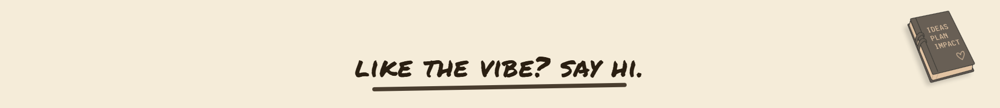

## my desk

*a pinboard of identity — hover any cutout for a short note, or open the full interactive desk on the site.*

<!-- desk collage — row 1 -->

  &#160;
  &#160;
  &#160;
  &#160;
  

<!-- desk collage — row 2 (avatar centred, taller) -->

  &#160;
  &#160;
  &#160;
  &#160;
  

<!-- desk collage — row 3 -->

  &#160;
  &#160;
  &#160;
  &#160;
  &#160;
  

  <b>tech · art · purpose</b> · <a href="https://anjalijha.info"><b>open the live desk →</b></a>

---

  
  &#8287;&#8287;&#8287;
  
  &#8287;&#8287;&#8287;
  
  &#8287;&#8287;&#8287;
  

  <a href="https://leetcode.com/u/anjalijha2k3">LeetCode</a> · <a href="https://medium.com/@anjalijha2k3">Medium</a> · <a href="https://www.figma.com/@blizet">Figma</a> · <a href="https://anjalijha.info">anjalijha.info</a>

 

Hi, I'm <b>Anjali</b> — a software developer and full-stack engineer who ships things that feel careful. Web3 systems, AI pipelines, and editorial interfaces. GSoC '25 with AOSSIE, building <b>Fate Protocol</b> — a decentralized perpetual prediction market on EVM. I like my code purposeful and my design with personality. tech · art · purpose ✦

---

## GitHub Stack :)

---

## Case Files

<table>
  <tr>
    <td width="50%" valign="top">
      <h3>
        
        &nbsp;Fate Protocol
      </h3>
      
Liquidity locked in fixed windows. Built a <b>perpetual</b> prediction market — trustless, always open, on-chain.

      

        
        
        
        
      

      
Solidity · viem · wagmi · ethers · RainbowKit

    </td>
    <td width="50%" valign="top">
      <h3>
        
        &nbsp;Prosper.dev
      </h3>
      
Approvals and buyers lost across sheets and email. One Firestore-backed source of truth that everyone trusts.

      

        
        
      

      
Next.js · Firebase · Firestore · Tailwind

    </td>
  </tr>
  <tr>
    <td width="50%" valign="top">
      <h3>
        
        &nbsp;Clowder
      </h3>
      
Effort in OSS and DAOs is invisible without trusted accounting. <b>CAT</b> tokens mint proof-of-work on-chain.

      

        
        
        
      

      
Solidity · React · TypeScript

    </td>
    <td width="50%" valign="top">
      <h3>
        
        &nbsp;Kridinify
      </h3>
      
Non-technical operators running scrapes, audits, and dashboards without an engineer on call.

      

        
        
        
      

      
FastAPI · React · PostgreSQL · Docker

    </td>
  </tr>
  <tr>
    <td width="50%" valign="top">
      <h3>
        
        &nbsp;Extraction Esports
      </h3>
      
Esports sites that read like banner farms. Built an editorial-grade brand system — narrative first.

      

        
        
      

      
Next.js · TypeScript · Tailwind · Figma

    </td>
    <td width="50%" valign="top">
      <h3>
        
        &nbsp;RNT
      </h3>
      
Busy brand site with no clear next step. Collapsed it to one calm screen — smart defaults, context kept.

      

        
        
      

      
React · Tailwind · Figma

    </td>
  </tr>
</table>

---

## Some Amazing Open Source Projects

  
  
  

---

