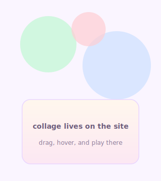

## my desk

*a pinboard of identity — hover any cutout for a short note, or open the full interactive desk on the site.*

<!-- desk collage — row 1 -->

  &#160;
  &#160;
  &#160;
  &#160;
  

<!-- desk collage — row 2 (avatar centred, taller) -->

  &#160;
  &#160;
  &#160;
  &#160;
  

<!-- desk collage — row 3 -->

  &#160;
  &#160;
  &#160;
  &#160;
  &#160;
  

<b>tech · art · purpose</b> · <a href="https://anjalijha.info" title="Portfolio — interactive desk"><b>open the live desk →</b></a>

---

sand · sticky notes · mint · coffee ink · Mithila colour — same palette as the desk cutouts above

  
  &#8287;&#8287;&#8287;
  
  &#8287;&#8287;&#8287;
  
  &#8287;&#8287;&#8287;
  

<a href="https://leetcode.com/u/anjalijha2k3">LC</a> · <a href="https://medium.com/@anjalijha2k3">writing</a> · <a href="https://www.figma.com/@blizet">frames</a>

---

## ✦ chapters

orange sticky · pink blockchain · green garden · black coffee mug

| | |
|:---:|:---|
| 🍊 | **GSoC ’25 · AOSSIE** → Fate · perpetual market · oracles · Solidity |
| 🏗️ | **Kridinify · SDE** → **15+** APIs · React · pipelines |
| ◇ | **Stability Nexus** → Fate · Web3 UI · React · Tailwind |
| 🔬 | **CDAC · R&D** |
| 🎙️ | **EOSGlobe** → voice · Azure TTS · Mistral · early RAG |
| ✎ | **AOSSIE mentor** → reviews · pairing · GSoC ’26 track |

---

## ✦ case files

one line each · deck order

| | → |
|:---:|:---|
| **⛓ Fate** | perpetual · dual vaults · **8** oracles · EVM live |
| **🏠 Prosper** | Firestore hub · **~60%** faster approvals |
| **🐾 Clowder** | **CAT** mints proof-of-work · on-chain |
| **🏗️ Kridinify** | **15+** services · scrapes · dashboards |
| **🎮 Extraction** | Figma → editorial Next · Esports |
| **📍 RNT** | one screen · calm defaults |

---

## ✦ stack strips

three lanes · what actually shipped

🧱 **on the desk**  
`react` · `next` · `ts` · `tailwind` · `fastapi` · `firebase` · `firestore` · `postgres` · `solidity` · `viem` · `wagmi` · `ethers` · `rainbowkit`

⚡ **daily drivers**  
`gsap` · `framer` · `redis` · `docker` · `gha` · `oauth` · `cloud fn` · `prisma`

🔭 **experiments**  
`rust` · `foundry` · `zk` · `three` · `langchain` · `mistral` · `azure tts`

---

## ✦ 2026 stamps

three targets · postcard style

<code>Fate v2</code> · oracle layer · live signals 
<code>mentor 3+</code> · first-time GSoC · real merges 
<code>1000+</code> · users · live markets

---

## ✦ git activity

---

## ✦ pinned

  
  
  

---

tech · art · purpose

