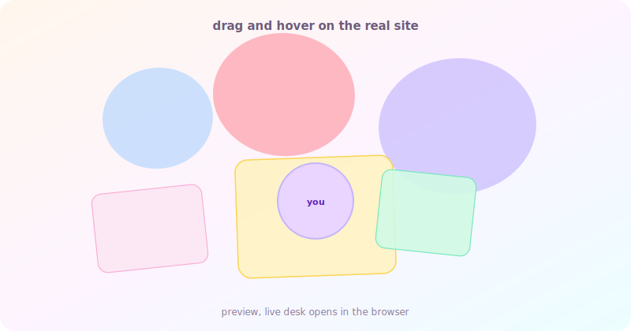

<!-- Replace banner.svg with your own art anytime; keep files in this repo for profile images. -->

  
  &#8287;&#8287;&#8287;
  
  &#8287;&#8287;&#8287;
  
  &#8287;&#8287;&#8287;
  

  <a href="https://leetcode.com/u/anjalijha2k3">LeetCode</a> ·
  <a href="https://medium.com/@anjalijha2k3">Medium</a> ·
  <a href="https://www.figma.com/@blizet">Figma</a>

---

## Anjali Jha

**Software developer and full stack engineer**

*Where code meets craft. Systems, interfaces, and ideas turned into something you can actually open and use.*

I like shipping products that feel careful: clear flows, honest tech choices, and visuals that do not scream for attention.

**Quick snapshot**

| | |
| --- | --- |
| **Based in** | Mumbai / IST |
| **Focus** | Web3, full stack, AI products |
| **Status** | Open to roles and collaborations |
| **Education** | B.E. Information Technology, Bharati Vidyapeeth College of Engineering (University of Mumbai), **CGPA 9.33** |

**At a glance:** 7+ projects shipped, **GSoC 25** with AOSSIE, 5+ roles and internships, **mentor** with AOSSIE OSS

---

## Highlights

- **GSoC 2025, AOSSIE.** Fate Protocol: a decentralized perpetual prediction market. Dual vault layout, many oracles, heavy Solidity work.
- **SDE, Kridinify.** Platform for multi site operators: **15+** FastAPI services, React dashboards, scheduled pipelines.
- **Apprenticeship, Stability Nexus.** Web3 and Fate frontend with React and Tailwind.
- **R&D, CDAC**
- **AI voice work, EOSGlobe.** Azure TTS and Mistral, early RAG and voice experiments.
- **Mentor, AOSSIE.** GSoC 26 mentor and maintainer track: reviews and pairing.

---

## Selected work

| | Problem | Outcome |
| --- | --- | --- |
| **Fate Protocol** | Liquidity stuck in fixed windows. | Perpetual market, dual vaults, eight oracles, live on EVM. |
| **Prosper.dev** | Approvals and buyers lost across sheets and email. | One Firestore hub users trust, roughly **60%** faster approvals. |
| **Clowder** | OSS and DAO work is hard to verify. | **CAT** tokens mint proof of work on chain: auditable and portable. |
| **Kridinify** | Operators need scrapes, audits, and dashboards without an engineer on call. | **15+** FastAPI services, React, scheduled pipelines. |
| **Extraction Esports** | Esports sites that read like banner farms. | Figma to Next.js editorial system: narrative, fast, scalable. |
| **RNT** | Busy brand site with no clear next step. | One calm screen, smart defaults, context preserved. |

The longer case studies live where you host your portfolio write ups.

---

## Desk

README files here cannot run the draggable React collage. You can still make the desk **easy to open** from your profile: link to a tiny **GitHub Pages** bridge in `docs/index.html`, plus an optional **GIF** so motion shows inline.

### Open from this README

  

  If that link 404s, enable Pages on this repo (branch <code>main</code>, folder <code>/docs</code>). If your Pages URL differs from <code>blizet.github.io/blizet</code>, change the link above to match.

**One time setup**

1. Deploy the Next app (Vercel, Netlify, or similar) and copy the public URL.
2. Open `docs/index.html`, set `DESK_URL` in the script to that URL, commit.
3. Repo **Settings → Pages →** source **Deploy from a branch**, branch **main**, folder **/docs**, save. After the build, the big image link above should open a page with an **Open the live desk** button.

**Optional motion in the README:** record a short screen capture, save as `images/desk.gif`, commit, then add a line under the image:

``

**Run locally:** `npm install` then `npm run dev`. Hero is `app/page.tsx`, desk is `components/desk.tsx` and `components/deskScene.tsx`. Cutout PNGs go in `public/images/colored/` (list in `public/images/colored/README.txt`).

**Source:** [app](https://github.com/blizet/blizet/tree/main/app) · [components](https://github.com/blizet/blizet/tree/main/components)

---

## Capabilities

*Grouped by what shipped in production, not invented bars.*

**Shipped:** React, Next.js 15, TypeScript, Tailwind, FastAPI, Firebase, Firestore, PostgreSQL, Solidity, viem, wagmi, ethers.js, RainbowKit

**Daily drivers:** GSAP, Framer Motion, Redis, Docker, GitHub Actions, OAuth 2.0, Cloud Functions, Prisma

**Exploring:** Rust, Foundry, ZK circuits, Three.js, LangChain, Mistral, Azure TTS

---

## Recognition, 2026

- Ship **Fate Protocol v2** with an oracle layer for pricing, aggregation, and live signals.
- Mentor **3+** first time GSoC and OSS contributors through real merges.
- Grow live market usage toward **1000+** engaged users.

---

## GitHub stats

---

## Pinned repositories

  
  
  

---

tech, art, purpose

